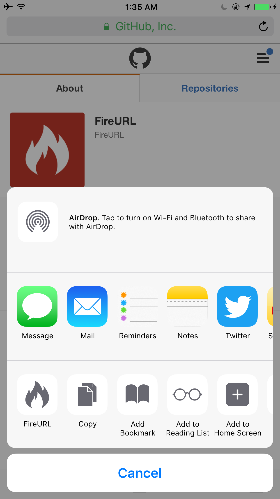
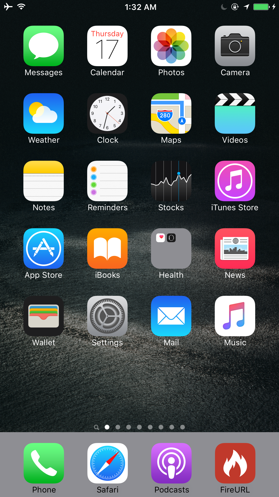

# FireURL Client for iOS
Conveniently fires an URL from iOS's pasteboard, and any link-based sharing app to a FireURL server, magically.

## Prerequisites
1. Computer with [FireURL Server](https://github.com/FireURL/FireURL-Server) (>= 0.3.1) running
2. OSX with XCode 7 installed
3. [Cocoapods](https://cocoapods.org/) installed
3. iOS Device (iOS >= 9.2)

## Installation
1. Clone and ```cd``` into this repo
2. Run ```pod install```
3. Open ```FireURL.xcworkspace```
4. Plug in your iOS device and press ```Run``` in XCode
5. FireURL for iOS is installed.

## Settings
You must specify the configurations of the [FireURL server](https://github.com/FireURL/FireURL-Server) in ```Settings.app``` of your iOS device before using this app.

1. Go into ```Settings.app``` on your iOS device
2. Scroll down, find, and tap on  ```FireURL```
3. Enter your FireURL server address and port
4. Quit ```Settings.app```. FireURL for iOS is now ready to use.

## Usage
### Using Share extension


1. Start your FireURL Server on your computer
2. Open a webpage on ```Safari``` on your iOS Device
3. Tap the ```Share``` button located at the bottom toolbar
4. Select ```FireURL``` (Enable it in ```More``` if not found)
5. See the webpage on ```Safari``` showing on your computer.

### Using the App Icon


1. Copy a URL to your clipboard on an iOS Device
2. Locate the app icon of ```FireURL```
3. Tap on the icon
4. See the webpage in your clipboard showing on your computer.
